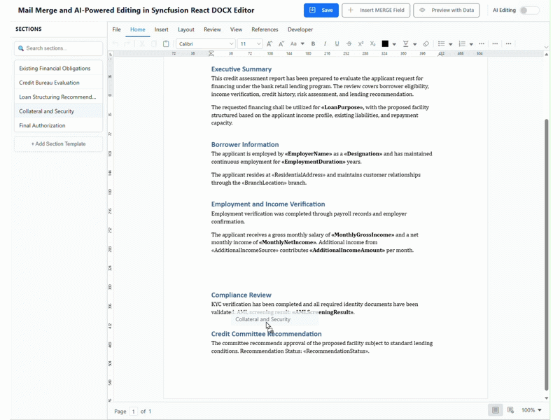

# Mail Merge and AI‑Powered Editing in Syncfusion React DOCX Editor

## Introduction


This sample demonstrates document editing, Mail Merge, and reusable document sections using the Syncfusion<sup style="font-size:70%">&reg;</sup> [React DOCX Editor](https://www.syncfusion.com/docx-editor-sdk/react-docx-editor?utm_source=github&utm_medium=listing&utm_campaign=github-github-documenteditor-examples) (Document Editor) in client and an ASP.NET Core Web API.


## Features

### AI-Assisted Editing

The AI Assist experience is integrated into the React DOCX editor and
communicates with Azure OpenAI through the ASP.NET Core API.

The sample supports:

-   AI content generation.
-   Rephrasing selected content.
-   Grammar improvement.
-   Translation.

The Azure OpenAI API key remains on the server and is not exposed to the
React client.

### Mail Merge

-   Execute Mail Merge using Syncfusion DocIO.
-   Open the merged result in the existing Document Editor.

A sample data file is available under for the default document loaded in the Document Editor:

``` text
Input Data/Retail and Credit approval.json
```

### Reusable Sections

-   Add and Load the reusable document sections from the Server.
-   Insert the section in to Document Editor either by drag-and-drop or insert by clicking the section.
-   Persist sections in:

``` text
Server-side/src/wwwroot/Data/sections.json
```
------------------------------------------------------------------------

## Prerequisites

Install the following before running the sample:

1. **.NET 10 SDK**
2. **Node.js and npm**
3. A valid **Syncfusion license key** for the Syncfusion components used by the sample.
4. An **Azure OpenAI** resource with a deployed chat-capable model if the AI features are required.
------------------------------------------------------------------------

## Configuration

### Azure OpenAI Configuration

Azure OpenAI configuration is located in:

``` text
Server-side/src/appsettings.json
```

The repository contains the following configuration section. Configure the chat settings for the AI functionality:

``` json
"AzureOpenAI": {
  "ChatEndpoint": "",
  "ChatApiKey": "",
  "ChatDeploymentName": ""
}
```

------------------------------------------------------------------------

### Web API Base URL

The React application gets the ASP.NET Core API URL from:

``` text
Client-side/src/service-config.js
```

The default configuration is:

``` javascript
export const API_BASE_URL = 'http://localhost:62870';
export const SERVICE_URL = `${API_BASE_URL}/api/DocumentEditor/`;
```

If the Web API is deployed to Azure, update `API_BASE_URL`.

For example:

``` javascript
export const API_BASE_URL = 'https://your-api.azurewebsites.net';
```

------------------------------------------------------------------------

## How to Run the Sample

### 1. Run the ASP.NET Core Web API

Open a terminal in:

``` text
Server-side/
```

Restore the NuGet packages:

``` bash
dotnet restore
```

Build the project:

``` bash
dotnet build
```

Run the API:

``` bash
dotnet run
```

The configured project profile uses:

``` text
http://localhost:62870/
```

Keep the API running.

------------------------------------------------------------------------

### 2. Run the React Client

Open another terminal in:

``` text
Client-side/
```

Install the npm dependencies:

``` bash
npm install
```

Start the Vite development server:

``` bash
npm run dev
```

Vite will display the client URL in the terminal.

Open the displayed URL in a browser.

------------------------------------------------------------------------
## Demo

This demo provides an overview of the main capabilities implemented in the sample.


### What the Demo Shows

- **Reusable Sections** – Add a DOCX section, save it on the server, and reuse it from the application.
- **DOCX Editing** – Open and edit a Word document directly in the browser using Syncfusion DocumentEditor.
- **Mail Merge** – Use the provided JSON data with a DOCX template to generate a merged document.
- **AI Assist** – Select content and use AI-powered actions such as Generate, Rephrase, Grammar Improvement, and Translation.


### Demo


-------------------------------------------------------------------------
## APIs

The following table lists the APIs relevant to the functionality
implemented and used by this sample. 

### Web API Base URL

``` text
http://localhost:62870/api/DocumentEditor/
```
| HTTP Method | API | Usage in the Sample |
|-------------|-----|---------------------|
| `POST` | `/api/DocumentEditor/Process` | Sends AI prompts/messages from the AI Assist UI to Azure OpenAI through the server. |
| `POST` | `/api/DocumentEditor/Import` | Converts an uploaded DOCX document into SFDT for opening in Syncfusion DocumentEditor. Also used when adding a reusable DOCX section. |
| `POST` | `/api/DocumentEditor/LoadString` | Converts AI-generated HTML content into SFDT so the generated content can be inserted into DocumentEditor. |
| `POST` | `/api/DocumentEditor/MailMerge` | Executes Mail Merge using the current DOCX document and the selected JSON data. Returns the merged document as SFDT. |
| `GET` | `/api/DocumentEditor/GetSections` | Loads the persisted reusable section catalog when the application starts. |
| `POST` | `/api/DocumentEditor/SaveSection` | Converts an uploaded DOCX section to SFDT and persists the section metadata/content in `wwwroot/Data/sections.json`. |
| `POST` | `/api/DocumentEditor/Save` | DocumentEditor server service used to save the editor document in the requested document format. |

## Resources

- **Product page:**   [Syncfusion® React DOCX Editor](https://www.syncfusion.com/docx-editor-sdk/react-docx-editor?utm_source=github&utm_medium=listing&utm_campaign=github-github-documenteditor-examples) 

- **Documentation:**   [Syncfusion® React DOCX Editor - Documentation](https://help.syncfusion.com/document-processing/word/word-processor/react/overview?utm_source=github&utm_medium=listing&utm_campaign=github-github-documenteditor-examples) 

- **Online demo:**   [Syncfusion® React DOCX Editor - Online demo](https://document.syncfusion.com/demos/docx-editor/react/#/tailwind3/document-editor/default?utm_source=github&utm_medium=listing&utm_campaign=github-github-documenteditor-examples) 

## Support and feedback 

For any other queries, reach our [Syncfusion® support team](https://support.syncfusion.com/?utm_source=github&utm_medium=listing&utm_campaign=github-github-documenteditor-examples) or post the queries through the [community forums](https://www.syncfusion.com/forums?utm_source=github&utm_medium=listing&utm_campaign=github-github-documenteditor-examples). 

Request new feature through [Syncfusion® feedback portal](https://www.syncfusion.com/feedback?utm_source=github&utm_medium=listing&utm_campaign=github-github-documenteditor-examples). 

## License

This is a commercial product and requires a paid license for possession or use Syncfusion's licensed software, including this component, is subject to the terms and conditions of [Syncfusion's EULA](https://www.syncfusion.com/license/studio/syncfusion_essential_studio_eula.pdf?utm_source=github&utm_medium=listing&utm_campaign=github-github-documenteditor-examples). You can purchase a licnense [here](https://www.syncfusion.com/sales/products?utm_source=github&utm_medium=listing&utm_campaign=github-github-documenteditor-examples) or start a free 30\-day trial [here](https://www.syncfusion.com/account/manage-trials/start-trials?utm_source=github&utm_medium=listing&utm_campaign=github-github-documenteditor-examples). 